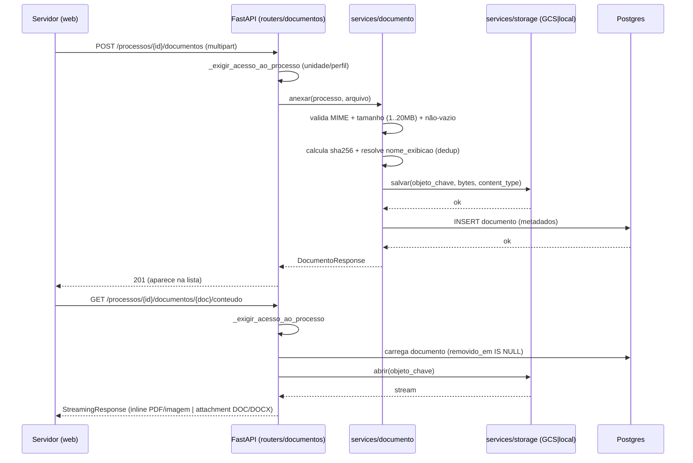

## Context

O Épico 3 estreia o **primeiro código de negócio que usa o Cloud Storage**. A
infra já existe: `bootstrap-infraestrutura` provisionou o bucket
`${project_id}-documentos` (`infra/storage.tf`) — regional (Brasil),
`public_access_prevention = enforced`, uniform bucket-level access, versionamento
e soft-delete **nativo de 30 dias como rede de segurança de infraestrutura** (não
é a regra de negócio). O `infra/iam.tf` já concede `storage.objectAdmin` às SAs de
runtime, com comentário explícito prevendo a "purga física de documentos
soft-deleted > 30d". A entidade `processo`, o modelo de autorização por unidade
(`_exigir_acesso_ao_processo`), o histórico imutável `tramitacao` e o
`job-manutencao-diaria` (com contrato de idempotência provado) já existem.

Este change adiciona: a tabela `documento`, um adaptador de armazenamento, o
serviço de documentos com as regras de custódia, os endpoints REST, a UI na tela
de detalhe do processo e um segundo passo no job diário (purga). A restauração
(US 8.7) é change futuro; aqui só se fecha a ponta da retenção.

## Goals / Non-Goals

**Goals:**
- Anexar/listar/visualizar-inline/baixar/remover documentos de um processo (US 3.1, 3.2).
- Soft-delete lógico com retenção de 30 dias e evento imutável de remoção.
- Regra de custódia correta para o bloqueio de remoção pós-despacho (Cen.4/4b/4c).
- Purga física idempotente pelo job diário, reusando o contrato de `rotinas-agendadas`.
- Confidencialidade LGPD do conteúdo: sem URL pública, acesso mediado pela API.
- Um adaptador de storage testável sem GCP (pytest usa Postgres real; E2E sem bucket real).

**Non-Goals:**
- **US 8.7 (restauração)** e a área "Documentos Removidos" do Admin — change futuro.
- **Assinatura (Épico 4)** — só se grava o `hash_sha256` como preparação; nada é assinado.
- Notificações de anexação (Épico 5), versionamento de anexos (fora do MVP por PRD).
- Antivírus/scan de conteúdo — não previsto no PRD do MVP (registrar em Open Questions).

## Decisions

### D1 — Regra de remoção é por **custódia**, não por status literal
O PRD parece dizer "pode remover se `Aberto`, não pode se despachado", mas o Cen.4b
permite remover num processo `Em Tramitação` **após devolução**. A regra unificada
correta: *pode remover enquanto o processo está sob custódia da minha unidade e
**ainda não foi despachado a partir desta custódia***. Implementação: a remoção é
permitida sse o **último evento de despacho para fora** (`despacho`/`conclusao`) é
**anterior** à entrada corrente do processo na unidade atual — equivalentemente,
se não há evento `despacho` cujo `unidade_origem_id` = `unidade_atual_id` posterior
ao último `devolucao`/criação que trouxe o processo à unidade atual. Regra prática
mínima e suficiente para os cenários do PRD: **permitido quando `status = Aberto`
OU (`status = Em Tramitação` E o processo entrou na unidade atual por `devolucao`
e ainda não houve `despacho` desde então)**. Alternativa descartada: "só `Aberto`"
— viola o Cen.4b; "sempre que o servidor tem acesso" — viola o Cen.4/4c.

### D2 — Estado de soft-delete **derivado**, nunca campo de texto
`documento.removido_em IS NULL` ⇔ visível. `purgar_em` é congelado como instante
absoluto (`removido_em + 30 dias`), espelhando o padrão já usado em
`processo.arquivar_em` (US 2.5 Cen.2). Sem coluna `status` textual — a listagem
filtra `WHERE removido_em IS NULL`, a purga varre `WHERE removido_em IS NOT NULL
AND purgar_em <= agora`. Justificativa: consistência com o invariante do projeto
(estados como predicado sobre o estado atual, retomável) e idempotência natural.

### D3 — Desduplicação de nome: chave de objeto ≠ nome de exibição
O objeto no bucket usa chave única e opaca (`{processo_id}/{documento_uuid}`),
desacoplada do nome. O `nome_original` é preservado; o `nome_exibicao` recebe o
sufixo `(n)` só quando colide com outro **documento visível** do mesmo processo
(`parecer.pdf` → `parecer (1).pdf`). Assim o Cen.5 não sobrescreve e o download
devolve o nome certo. Alternativa descartada: nome como chave do objeto — colide,
e caracteres de nome de arquivo poluiriam a chave.

### D4 — Adaptador de storage com backend real (GCS) e local (filesystem)
`services/storage.py` expõe uma interface pequena (`salvar(chave, bytes,
content_type) -> None`, `abrir(chave) -> stream`, `url_assinada(chave, ttl) ->
str`, `remover(chave) -> None`). Backend selecionado por config, espelhando o
padrão dev/prod de `email/provider.py`: **GCS** em produção (google-cloud-storage,
ADC via SA do Cloud Run — sem chave JSON) e **filesystem local** em
pytest/E2E/dev (diretório temporário, "url assinada" = rota autenticada da própria
API). Justificativa: os testes usam Postgres real, mas **não** GCP; sem o backend
local, nada seria testável fora da nuvem. Nova dependência: `google-cloud-storage`.

### D5 — Servir conteúdo: streaming autenticado pela API (não URL pública)
Confidencialidade LGPD (proposal). Duas opções: (a) **URL assinada V4 de TTL
curto** (~5 min) emitida pela API após autorizar por unidade; (b) **streaming
pela API** (`StreamingResponse`). Decisão: **streaming pela API** para o MVP —
mais simples, funciona idêntico no backend local (E2E) e no GCS, e mantém toda a
autorização num só lugar (`_exigir_acesso_ao_processo`). `Content-Disposition:
inline` para PDF/imagem (Cen.1), `attachment` para download (Cen.2) e sempre
`attachment` para DOC/DOCX (Cen.3). URL assinada fica como otimização futura se a
banda da API virar gargalo (Open Question).

### D6 — Evento `remover_documento` no histórico imutável
A remoção é registrada em `tramitacao` (novo valor de enum), com `responsavel_id`
= quem removeu, unidades nulas, `status_resultante` = status atual. O CHECK
`ck_tramitacao_responsavel` (migration `0004`) permanece satisfeito (só o
`arquivamento_automatico` dispensa responsável). A **anexação NÃO gera evento de
tramitação** — o PRD só exige registro para a remoção (Cen.3); a autoria da
anexação vive em `documento.anexado_por_id`/`anexado_em`.

### D7 — Purga é novo passo do job diário, idempotente por estado
`app/jobs/entrypoint.py` passa a rodar dois passos: `arquivar_vencidos` (existente)
e `purgar_documentos_vencidos` (novo). O passo remove o objeto do bucket **e
depois** a linha do banco, por documento, com commit por item (retomável a meio
caminho). Seleção por estado atual (`removido_em IS NOT NULL AND purgar_em <=
agora`) garante idempotência: uma segunda execução não encontra o que já foi
purgado (Cen. de retomada). Reusa o contrato já provado em `rotinas-agendadas`.
Ordem GCS-antes-de-DB: se o processo cair após deletar o objeto e antes do commit,
a próxima execução re-tenta o `remover` (idempotente — objeto ausente é no-op) e
conclui o DELETE do banco; nunca fica linha órfã apontando para objeto vivo.

## Migration Plan (schema antes de endpoint/serviço)

**Migration `0006_gestao_documental`** (encadeada em `0005_sigilo_processo`):
1. `CREATE TABLE documento` com colunas descritas na proposal (`id`, `processo_id`
   FK, `nome_original`, `nome_exibicao`, `objeto_chave UNIQUE`, `tipo_conteudo`,
   `tamanho_bytes CHECK (> 0)`, `hash_sha256`, `anexado_por_id` FK, `anexado_em`,
   `removido_em NULL`, `removido_por_id NULL` FK, `purgar_em NULL`).
2. Índice parcial `ix_documento_processo_visivel ON documento(processo_id) WHERE
   removido_em IS NULL` (listagem) e `ix_documento_purga ON documento(purgar_em)
   WHERE removido_em IS NOT NULL` (varredura da purga).
3. Adicionar valor `remover_documento` ao enum `tipo_evento_tramitacao`
   (`ALTER TYPE ... ADD VALUE`; em bloco próprio — Postgres não permite ADD VALUE
   e uso na mesma transação).
4. `downgrade`: `DROP TABLE documento`; o valor de enum não é removido (limitação
   do Postgres — documentar, sem impacto: valor órfão é inócuo).

Deploy segue o pipeline padrão: o Cloud Run Job de migrations roda `0006` **antes**
de trocar o serviço `api` (mesmo fluxo dos changes anteriores). Rollback: reverter
o deploy do serviço; a tabela nova é inerte para o código antigo.

## Sequência — Anexar e servir documento (US 3.1/3.2, front→back→GCS)

## Job diário — gatilho, janela, retomada

- **Gatilho/janela:** inalterados — Cloud Scheduler → `job-manutencao-diaria`, cron
  diário 03:00 America/Bahia (provisionado no bootstrap). Este change só **acresce**
  o passo de purga ao entrypoint existente.
- **Idempotência/retomada:** seleção por estado atual (`purgar_em <= agora AND
  removido_em IS NOT NULL`), commit por documento, GCS-antes-de-DB (D7). Execução
  perdida por indisponibilidade é recuperada na próxima corrida (varre todos os
  vencidos), sem duplicar efeito nem perder documentos — mesmo contrato do
  arquivamento (`rotinas-agendadas`).

## Riscos / Trade-offs

- **[Streaming pela API consome banda/CPU do serviço]** → aceitável no MVP (anexos
  ≤ 20 MB, volume moderado); D5 deixa a porta aberta para migrar a URL assinada V4
  sem mudar o contrato de autorização. Mitigar limites de memória usando
  streaming em chunks, nunca carregando o arquivo inteiro em RAM.
- **[Regra de custódia (D1) mal interpretada → vazamento de "remover após despacho"]**
  → coberta por testes explícitos dos quatro cenários (Cen.4/4b/4c e o caminho
  feliz Cen.3), que tocam o histórico e são obrigatórios.
- **[Divergência entre soft-delete nativo do bucket (infra) e o lógico (negócio)]**
  → são camadas distintas e não conflitam: o de negócio (DB + job) é a fonte da
  verdade da retenção de 30 dias; o nativo do bucket é rede de segurança de infra.
  A purga (D7) faz `remover` no GCS; o soft-delete nativo ainda guarda o objeto
  por mais 30 dias como salvaguarda de infra — documentar para não confundir com
  restaurabilidade de negócio (que é a US 8.7, e opera sobre o DB, não o bucket).
- **[Falha parcial na purga (objeto deletado, DB não commitado)]** → D7 (ordem +
  idempotência do `remover`) garante convergência na próxima execução.
- **[Upload de arquivo com MIME falsificado]** → validar por extensão **e**
  sniffing do content-type real do stream; rejeitar divergência. Teste dedicado.

## Open Questions

- **Antivírus/scan de conteúdo malicioso** no upload: o PRD do MVP não exige;
  confirmar com o cliente se entra agora ou vira change de hardening futuro.
- **URL assinada V4** vs streaming: adotar streaming agora (D5); revisitar se
  telemetria de produção mostrar a API como gargalo de banda.
- **Limite de storage por processo/unidade**: não previsto no PRD; assumir sem
  cota no MVP, registrar como possível parâmetro de `sistema_config` futuro.
