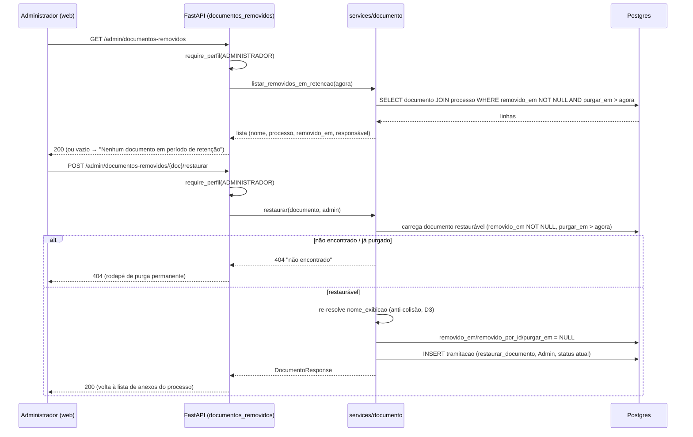

## Context

`gestao-documental` (fatia A) implementou o soft-delete de anexos em
`services/documento.py`: `remover()` congela `removido_em`/`removido_por_id`/
`purgar_em = removido_em + 30d` e insere o evento imutável `remover_documento`;
`purgar_documentos_vencidos()` (passo do job diário) apaga fisicamente do bucket e
do banco quando `purgar_em <= agora`. Entre esses dois instantes há uma **janela
de retenção de 30 dias** em que o objeto ainda existe no bucket e a linha ainda
existe no banco, apenas invisível (`removido_em IS NOT NULL`). Este change torna
essa janela **reversível pelo Administrador** (US 8.7), sem tocar na retenção nem
na purga.

## Goals / Non-Goals

**Goals:**
- Administrador lista os documentos em retenção (cross-unidade) e restaura um deles.
- Restauração = inversa exata do soft-delete + evento imutável `restaurar_documento`.
- Documento já purgado não aparece e não é restaurável (US 8.7 Cen.2).
- Estados vazio (Cen.3) e rodapé de purgados (Cen.2) na UI.

**Non-Goals:**
- Mudar a retenção de 30 dias ou o passo de purga (`gestao-documental` é o dono).
- Restaurar após a purga física (irreversível por design LGPD).
- Regra de custódia na restauração — é ação administrativa, não de custódia (D1).

## Decisions

### D1 — Restauração é ação administrativa, sem regra de custódia
Diferente da **remoção** (que exige `pode_remover`, ligada ao status/despacho), a
**restauração** é do Administrador (acesso irrestrito) e independe do status atual
do processo ou da unidade em que ele esteja. O documento volta à lista de anexos
seja o processo `Aberto`, `Em Tramitação`, `Concluído` ou `Arquivado`. Justificativa:
US 8.7 é correção de exclusão indevida pelo guardião da configuração, não uma
operação de fluxo. Alternativa descartada: espelhar `pode_remover` — bloquearia a
correção justamente nos processos já despachados, que são o caso comum de "removi
por engano e o processo andou".

### D2 — Janela de restaurabilidade é derivada do estado, não de nova coluna
Restaurável ⇔ `removido_em IS NOT NULL AND purgar_em > agora`. Não há flag nova:
o mesmo `purgar_em` que a purga usa define a fronteira. Purgado ⇔ a linha **não
existe mais** (a purga faz `DELETE`), então "documento purgado" é naturalmente um
404 — não é preciso distinguir "purgado" de "inexistente" (US 8.7 Cen.2 usa a
mesma resposta). O rodapé informativo é puramente de UI.

### D3 — Restaurar re-resolve o `nome_exibicao` (anti-colisão)
Durante a ausência do documento, outro anexo com o mesmo `nome_exibicao` pode ter
sido criado (a desduplicação de `gestao-documental` só olha os **visíveis** no
momento do anexo). Ao restaurar, o serviço **reaplica** `_resolver_nome_exibicao`
sobre os visíveis atuais: se colidir, o restaurado recebe `(n)`. Assim o invariante
"nomes de exibição visíveis são únicos por processo" é preservado e nada é
sobrescrito. Reusa o helper já existente (extrair/expor se necessário). Alternativa
descartada: restaurar com o nome antigo e aceitar duplicata visível — quebra o
mesmo invariante que o Cen.5 de `gestao-documental` protege.

### D4 — Sem operação de storage na restauração
O objeto nunca saiu do bucket durante a retenção (só a purga o remove, e purgado
não é restaurável). Restaurar é **só** mudança de estado no banco (limpar os três
campos) + evento. Nenhuma chamada a `Storage`. Simetria com a remoção, que também
não toca o storage (só a purga toca).

### D5 — Novo router administrativo, cross-unidade
`routers/documentos_removidos.py`, prefixo `/admin/documentos-removidos`, todos os
endpoints com `Depends(require_perfil(PerfilUsuario.ADMINISTRADOR))`. Não usa
`_exigir_acesso_ao_processo` (que é por unidade) — o Admin vê tudo. A listagem faz
join com `processo` para trazer número/assunto. Endpoints:
`GET /admin/documentos-removidos` (lista em retenção) e
`POST /admin/documentos-removidos/{documento_id}/restaurar`.

### D6 — Evento `restaurar_documento` no histórico imutável
Espelha `remover_documento` (D6 de `gestao-documental`): `responsavel_id` = Admin,
unidades nulas, `status_resultante` = status atual do processo. O CHECK
`ck_tramitacao_responsavel` (migration `0004`) permanece satisfeito. A restauração
é evento de histórico do **processo de origem** (via `documento.processo_id`).

## Migration Plan (schema antes de endpoint/serviço)

**Migration `0007_restauracao_documento`** (encadeada em `0006_gestao_documental`):
1. `ALTER TYPE tipo_evento_tramitacao ADD VALUE 'restaurar_documento'` — em bloco
   próprio (Postgres não permite ADD VALUE e uso na mesma transação), idêntico ao
   padrão de `0006`.
2. Sem tabela nova, sem coluna nova, sem índice novo.
3. `downgrade`: no-op documentado — o valor de enum não é removido (limitação do
   Postgres; valor órfão é inócuo).

Deploy segue o pipeline padrão (job de migrations antes de trocar o serviço).
**Ordenação de changes:** este change assume `gestao-documental` **arquivado
antes** — a migration `0006` e o enum `remover_documento` precisam existir; e a
sincronização das specs base (`gestao-documental`, `workflow-tramitacao` com
`remover_documento`) deve preceder o archive deste, para os deltas casarem.

## Sequência — Restaurar documento (Admin, front→back)

## Riscos / Trade-offs

- **[Corrida restauração × purga do job diário]** → a purga (`purgar_em <= agora`)
  e a restauração (`purgar_em > agora`) têm predicados **disjuntos** no mesmo
  instante; e a purga faz `DELETE` linha a linha com commit. Se o job purgar entre
  o GET e o POST, o POST carrega "restaurável" e não encontra a linha → 404 limpo
  (US 8.7 Cen.2). Sem estado inconsistente. Mitigar recarregando o documento com o
  predicado de retenção **dentro** da transação de restauração (não confiar no id
  vindo da listagem).
- **[Colisão de nome na restauração]** → D3 (re-resolução) cobre; teste dedicado.
- **[Admin restaura em processo `Arquivado`]** → permitido (D1); o anexo reaparece,
  o status não muda. Documentar que não reabre nem altera o processo.
- **[Deltas de spec sobre base ainda não sincronizada]** → risco de ordenação de
  archive, não de runtime; mitigado pela nota de ordenação no Migration Plan
  (arquivar `gestao-documental` primeiro).

## Open Questions

- **Retenção configurável (US 8.5)**: hoje `RETENCAO_DIAS = 30` é constante em
  `services/documento.py`. Se virar parâmetro de `sistema_config` num change
  futuro, a fronteira de restaurabilidade passa a depender do valor vigente no
  momento da remoção (mesmo padrão de `arquivar_em`) — fora de escopo aqui.
